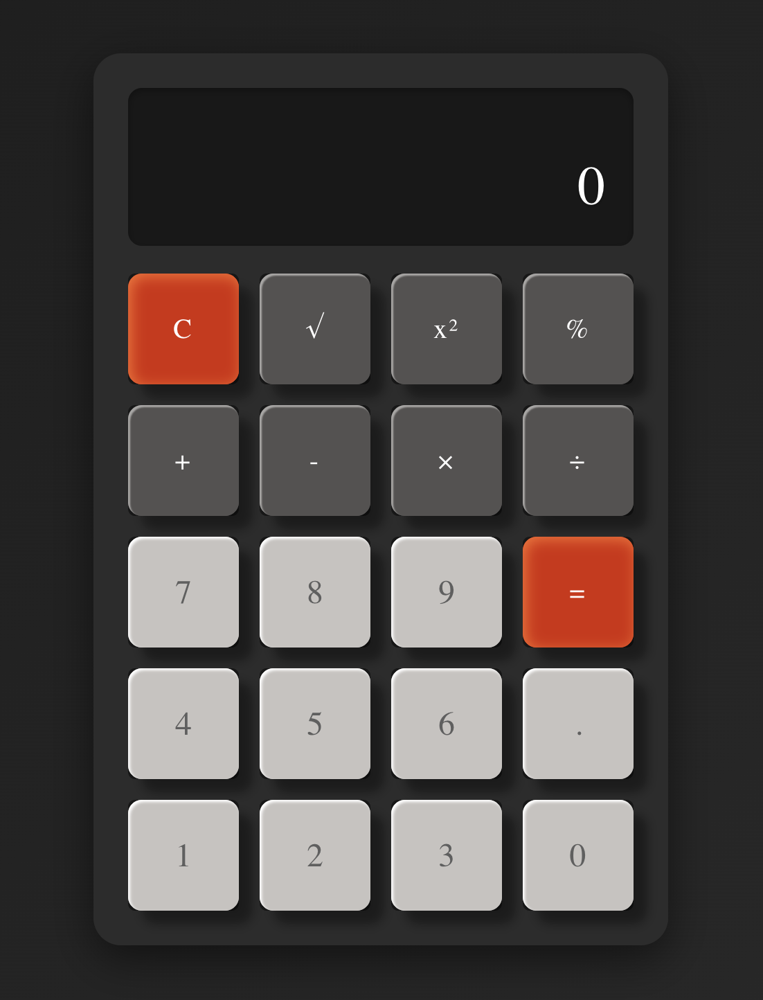

# Calculator App / Калькулятор

A modern calculator with realistic button press effects and sleek design.  
Современный калькулятор с реалистичными эффектами нажатия клавиш и стильным дизайном.



## Features / Особенности
- Realistic button press effects / Реалистичные эффекты нажатия клавиш
- Modern glassmorphism design / Современный дизайн в стиле стекломорфизма
- Responsive layout / Адаптивный дизайн
- Basic and advanced mathematical operations / Базовые и продвинутые математические операции
- Smooth animations / Плавные анимации

## Installation / Установка

```bash
# Clone the repository / Клонировать репозиторий
git clone [repository-url]

# Navigate to the project directory / Перейти в директорию проекта
cd calculator

# Install dependencies / Установить зависимости
npm install

# Start the development server / Запустить сервер разработки
npm run dev
```

## Design / Дизайн
The calculator features a modern glassmorphism design with:
- Semi-transparent background / Полупрозрачный фон
- Blur effects / Эффекты размытия
- Realistic button shadows / Реалистичные тени кнопок
- Press animation effects / Анимации нажатия
- Smooth transitions / Плавные переходы

Калькулятор выполнен в современном стиле стекломорфизма с:
- Полупрозрачным фоном
- Эффектами размытия
- Реалистичными тенями кнопок
- Анимациями нажатия
- Плавными переходами

## Available Operations / Доступные операции
- Basic arithmetic (+, -, ×, ÷) / Базовые арифметические операции
- Square root (√) / Квадратный корень
- Square (x²) / Возведение в квадрат
- Percentage (%) / Процент
- Decimal point (.) / Десятичная точка

## Technologies / Технологии
- Vue 3
- Vite
- CSS3
- JavaScript
